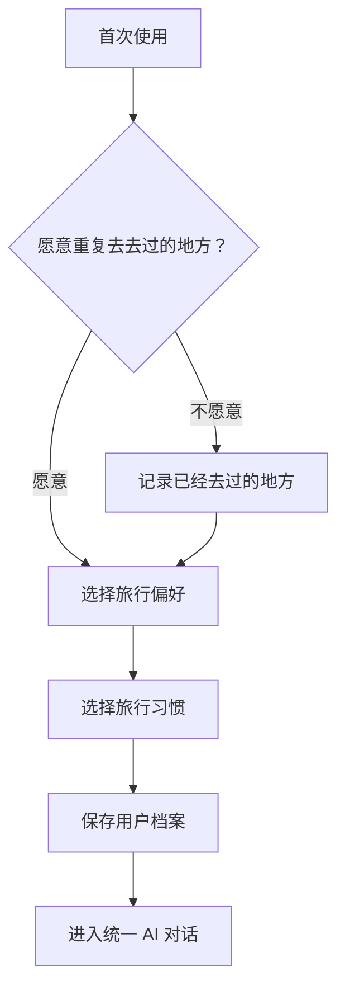

# MVP：AI Travel Planner

## 产品概述

AI Travel Planner 是一款智能旅行规划产品。用户通过自然语言描述旅行需求，AI 自动判断用户处于目的地探索阶段还是详细规划阶段，并生成符合其预算、时间和个人偏好的旅行建议。

产品将综合以下信息：

- 全网真实旅行反馈，例如小红书等平台的攻略和评价
- 实时酒店价格
- 地图位置与路线规划
- 用户档案中的长期旅行偏好

## 产品目标

- 降低用户筛选目的地和制定旅行计划的成本
- 根据真实反馈、实时价格和地图信息提供可执行的建议
- 通过持续积累用户档案，让推荐结果越来越符合个人偏好
- 在同一个对话入口中完成目的地探索与详细行程规划

## 核心交互原则

产品只提供统一的 AI 对话入口。用户不需要了解或手动选择模式，AI 根据输入内容自动判断应进入 `EXPLORE` 还是 `PLAN` 流程。

### 自动判断规则

- 用户没有提供明确目的地：进入 `EXPLORE`
- 用户已经提供明确目的地：进入 `PLAN`
- 用户意图或目的地不明确：AI 主动追问必要信息
- 用户可在对话中随时更换目的地、预算、时间或其他约束
- `EXPLORE` 中选定目的地后，自动衔接至 `PLAN`

## EXPLORE：探索目的地

### 适用场景

用户有旅行意愿，但尚未决定目的地。

### 输入信息

- 旅行目的，例如休闲、亲子、美食或户外
- 可用时间、日期和旅行天数
- 总预算
- 出发地
- 其他偏好或限制
- 用户档案中的历史旅行信息和长期偏好

### 输出内容

- 至少三个候选目的地
- 每个目的地的推荐理由及与用户需求的匹配度
- 真实旅行反馈及信息来源
- 预计交通和住宿成本
- 天气、签证或季节性限制等必要提醒
- 若用户不愿重复前往去过的地方，应排除已去过的目的地

## PLAN：详细规划行程

### 适用场景

用户已有明确目的地，希望生成详细旅行计划。

### 输入信息

- 目的地
- 出发地
- 日期和旅行天数
- 预算范围
- 用户的即时要求
- 用户档案中的长期旅行偏好

### 输出内容

- 按天划分的详细行程
- 景点、餐饮和活动推荐
- 实时酒店价格及住宿建议
- 基于地图位置优化的每日路线
- 交通、住宿、餐饮和活动的预算分配
- 总费用估算
- 推荐内容的信息来源
- 可继续对话调整或重新生成计划

## 旅行计划管理与协作

旅行计划是产品中的核心内容对象。用户可以通过 AI 创建和持续修改计划，将计划保存到个人账户，也可以分享给其他用户共同编辑。

### 1. AI 创建、修改和保存旅行计划

- 用户可以通过自然语言让 AI 创建完整旅行计划
- 用户可以继续通过对话修改日期、预算、目的地、酒店、景点、路线和行程节奏
- AI 修改时应保留用户未要求变更的内容
- 每次修改后保存最新版本，确保用户离开后可以继续编辑
- 计划应记录标题、目的地、日期、预算、参与者、每日行程、更新时间和创建者

### 2. 分享、共同修改和同步

- 用户可以通过分享链接将旅行计划发送给他人
- 被分享者可以查看计划，并在拥有编辑权限时继续修改
- 被分享者既可以直接调整计划，也可以通过 AI 提出修改要求
- 协作者的修改应同步到同一份旅行计划，并对其他协作者可见
- 系统需要明确展示计划创建者、协作者和最近更新时间
- 分享者可以管理他人的查看或编辑权限

### 3. 历史旅行计划

- 用户可以浏览自己曾经生成和保存的旅行计划
- 计划列表应展示标题、目的地、旅行日期、更新时间和协作状态
- 用户可以打开任意历史计划进行查看、继续修改或再次分享
- 计划列表默认按最近更新时间排序

## 冷启动流程

首次使用产品时，系统通过冷启动流程了解用户的长期旅行偏好，并将信息保存至用户档案。



### 1. 是否愿意重复前往去过的地方

- 愿意：跳过已去地点录入，进入旅行偏好设置
- 不愿意：进入已去地点录入，然后继续设置旅行偏好

### 2. 已去过的地方

仅在用户不愿重复前往去过的地方时要求填写：

- 国内地点：以省、市为记录粒度
- 国外地点：以国家为记录粒度

### 3. 旅行偏好

支持多选：

- 亲近自然
- 人文观光
- 当地特色
- 其他：允许用户自行填写

### 4. 旅行习惯

- 顶级奢旅
- 舒适充电
- 特种兵

## 用户档案

### 建议数据结构

```json
{
  "allow_repeat_destinations": true,
  "visited_places": {
    "domestic": [
      { "province": "云南省", "city": "大理市" }
    ],
    "international": ["日本"]
  },
  "travel_preferences": ["亲近自然", "当地特色"],
  "travel_preference_other": "摄影",
  "travel_style": "舒适充电"
}
```

### 使用方式

每次用户发起旅行问答时，系统将用户档案作为结构化上下文拼接到 User Prompt 中：

- `EXPLORE` 根据是否接受重复目的地，排除或降低已去地点的推荐优先级
- 根据旅行偏好筛选候选目的地，并解释推荐原因
- 根据旅行习惯调整酒店档次、交通方式、行程密度和预算分配
- 用户当前对话中的明确要求优先于用户档案中的历史偏好

### 修改方式

- 用户可在个人档案页查看和修改所有信息
- 用户可通过自然语言修改，例如“以后不要给我推荐特种兵行程”
- 修改后立即保存，并用于后续问答

## Demo 验收标准

### 冷启动与档案

- [ ] 首次使用时自动进入冷启动流程
- [ ] 根据用户是否接受重复目的地正确执行条件分支
- [ ] 国内和国外地点按规定粒度保存
- [ ] 旅行偏好支持多选和自定义“其他”选项
- [ ] 用户档案可查看、修改并持久化
- [ ] 修改后的档案立即影响后续回答

### 模式判断

- [ ] 产品只提供统一对话入口，不要求用户选择模式
- [ ] AI 能根据是否存在明确目的地自动进入对应流程
- [ ] 输入信息不足时，AI 会提出必要的澄清问题
- [ ] 用户选定目的地后，可从 `EXPLORE` 自然衔接至 `PLAN`

### EXPLORE

- [ ] 至少推荐三个有依据的候选目的地
- [ ] 推荐结果体现时间、预算、旅行目的和用户档案约束
- [ ] 不接受重复目的地的用户不会收到已去地点推荐
- [ ] 展示真实旅行反馈及其信息来源

### PLAN

- [ ] 输出按天划分的完整行程
- [ ] 展示酒店实时价格和预算估算
- [ ] 同一天的地点按地图位置和交通成本合理排序
- [ ] 推荐内容展示信息来源
- [ ] 用户可以通过对话调整或重新生成计划

### 计划创建与保存

- [ ] 用户可以通过 AI 创建新的旅行计划
- [ ] 用户可以通过自然语言修改已有计划
- [ ] AI 修改后保留未被要求变更的内容
- [ ] 计划修改后能够保存，并在重新进入产品后继续查看和编辑

### 分享与协作

- [ ] 用户可以生成旅行计划分享链接
- [ ] 被分享者可以根据权限查看或编辑计划
- [ ] 被分享者可以通过 AI 继续修改同一份计划
- [ ] 一名协作者保存修改后，其他协作者可以看到最新内容
- [ ] 分享者可以修改或取消他人的访问权限

### 历史计划

- [ ] 用户可以浏览自己创建或参与协作的旅行计划
- [ ] 历史计划列表展示目的地、旅行日期和最近更新时间
- [ ] 用户可以打开历史计划继续修改或分享
- [ ] 计划默认按最近更新时间排序

## 待验证事项

- 小红书等内容平台的数据获取方式、稳定性与合规性
- 酒店实时价格的数据来源、覆盖范围和更新频率
- 地图与路线规划服务的选择及调用成本
- 总预算默认是否包含机票、餐饮和当地交通
- 用户档案及旅行历史的隐私、授权和删除机制
- 用户偏好与当前指令冲突时的具体优先级策略
- 分享链接的登录要求、有效期和默认权限
- 多人同时修改计划时的冲突处理与版本恢复机制
- 协作修改采用实时同步还是保存后同步

## 建议标签

`product-idea` `MVP` `demo` `AI` `travel-planner`
